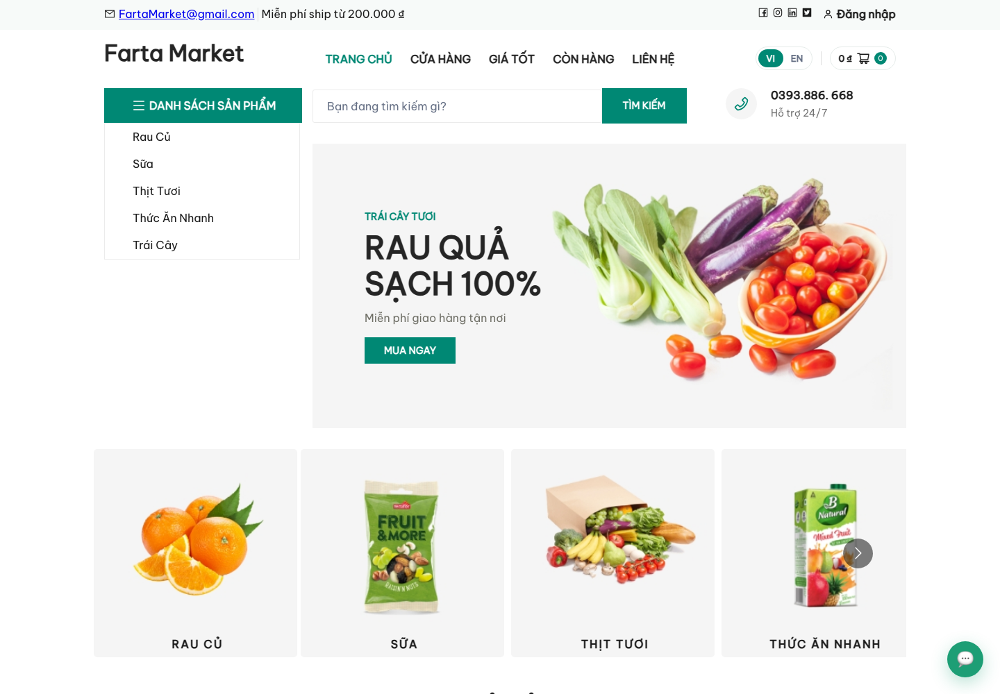
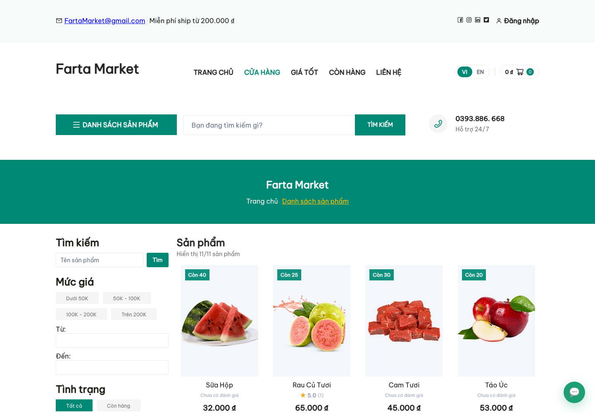
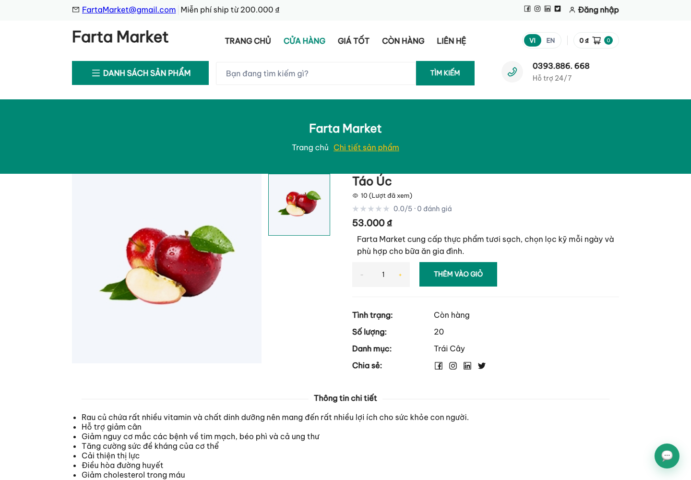
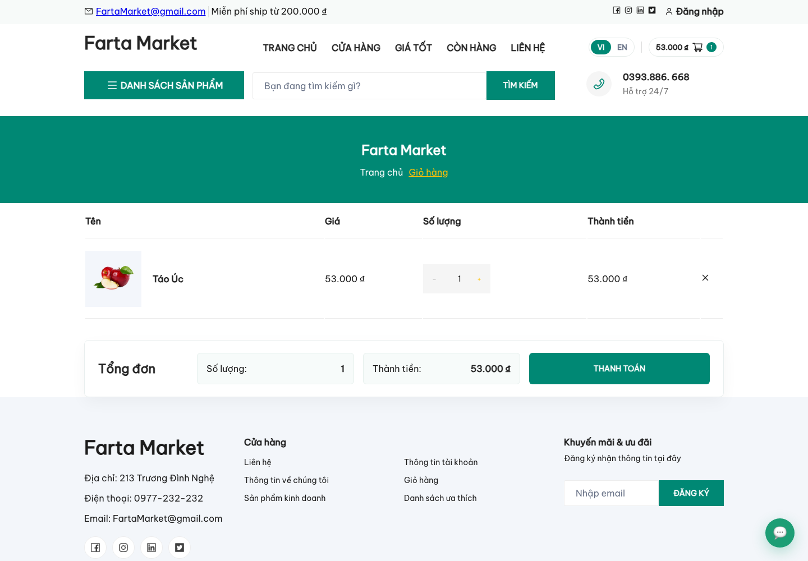
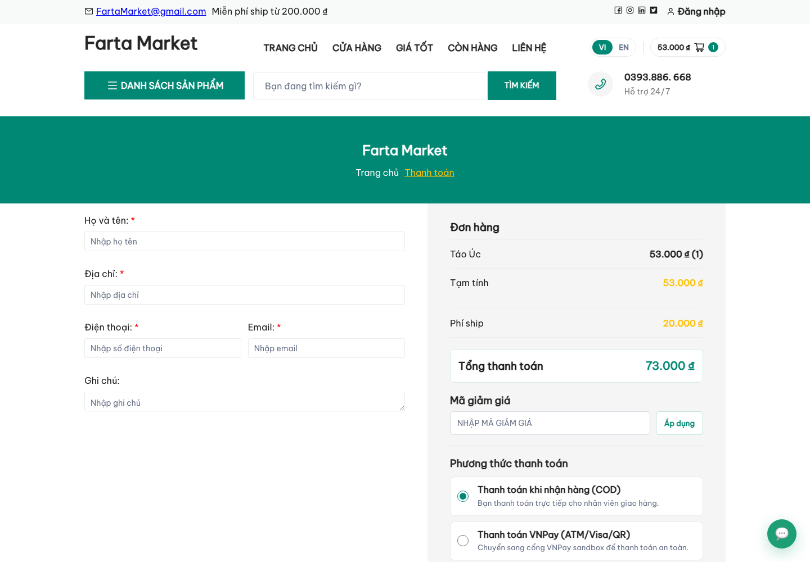
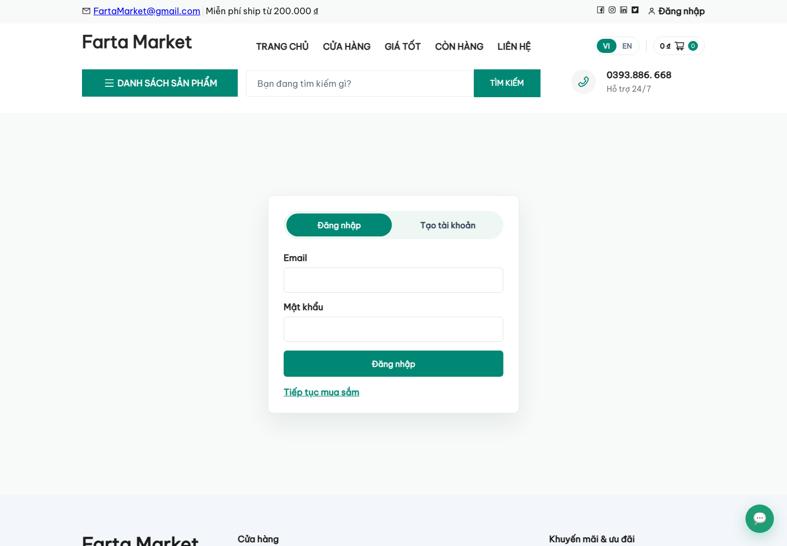
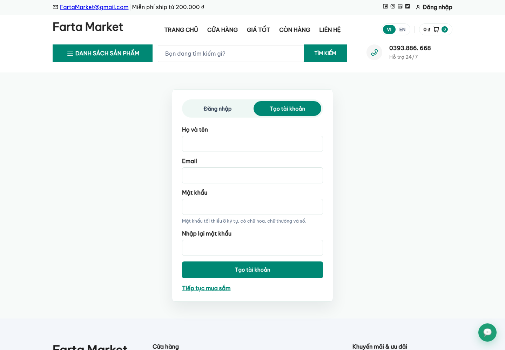
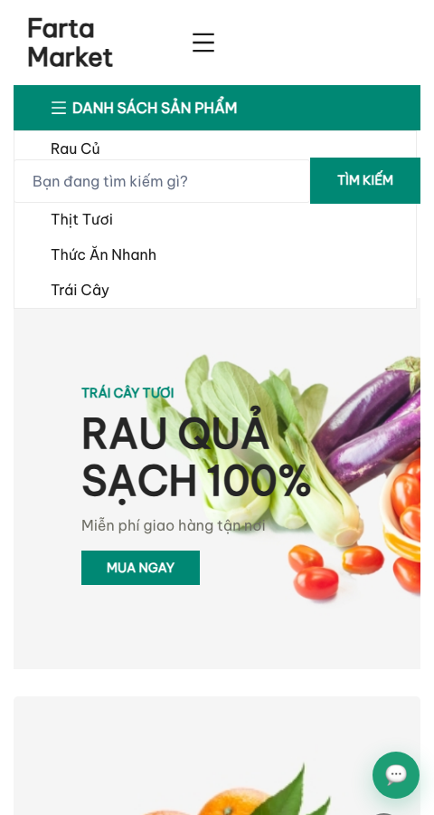

# Farta Market Frontend

## Overview

Farta Market Frontend is the customer-facing web application for a fresh food e-commerce platform. It is built with React 19, Vite, JavaScript, and SCSS, with a focus on product browsing, cart management, checkout, authentication, wishlist, reviews, and bilingual UI support.

The frontend is designed to integrate with a Laravel backend API. Product data, authentication, checkout, wishlist, reviews, chat, and admin features require a running backend service configured through environment variables.

## Features

- Product listing page with category, stock, price, search, sorting, and pagination UI
- Product detail page with gallery, quantity selector, cart action, reviews, related products, and frequently-bought-together sections
- Shopping cart workflow with persistent cart state
- Checkout flow with customer information, coupon input, COD/VNPay payment options, and order summary
- Customer login and registration screens
- Wishlist UI and shopping cart actions
- AI chat widget connected to the backend chat endpoint
- VI/EN bilingual UI with `react-i18next`
- Responsive layouts for desktop and mobile breakpoints
- Admin route structure for dashboard, orders, products, categories, coupons, and users
- Unit tests with Vitest and end-to-end tests with Playwright

## Tech Stack

- **Frontend:** React 19, Vite, JavaScript
- **Routing:** React Router
- **State Management:** Redux Toolkit, React Redux
- **Data Fetching:** Axios, TanStack Query
- **Styling:** SCSS, CSS
- **Internationalization:** i18next, react-i18next
- **UI Utilities:** React Icons, React Hot Toast, React Multi Carousel
- **Testing:** Vitest, Testing Library, Playwright
- **Tooling:** npm, Git, Vite

## Screenshots

### Home Page



### Product Listing



### Product Detail



### Shopping Cart



### Checkout



### Login



### Register



### Mobile View



## Project Structure

```text
.
├── public/
├── src/
│   ├── api/
│   ├── assets/
│   ├── component/
│   ├── config/
│   ├── hooks/
│   ├── i18n/
│   ├── pages/
│   ├── redux/
│   ├── style/
│   └── utils/
├── tests/
│   └── e2e/
├── docs/
│   └── screenshots/
├── index.html
├── package.json
├── playwright.config.ts
├── vite.config.js
└── README.md
```

## Getting Started

Install dependencies:

```bash
npm install
```

Create a local environment file:

```bash
cp .env.example .env
```

Start the Vite development server:

```bash
npm run dev
```

Open the local site in your browser:

```text
http://127.0.0.1:5173
```

## Environment Variables

The frontend expects the backend API to be available through `VITE_API_URL`.

```dotenv
VITE_API_URL=http://127.0.0.1:8000/api
VITE_API_TIME_OUT=20000
VITE_SITE_URL=http://127.0.0.1:5173
```

For production builds, set `VITE_API_URL` to the public Laravel API URL before running `npm run build`.

```bash
VITE_API_URL=https://api.example.com/api npm run build
```

Do not commit real secrets, API keys, access tokens, or local `.env` files.

## Available Scripts

```bash
npm run start
npm run dev
npm run build
npm run preview
npm run test
npm run test:e2e
```

## Testing

Run unit tests:

```bash
npm run test
```

Install Playwright browsers:

```bash
npx playwright install chromium
```

Run end-to-end tests:

```bash
npm run test:e2e
```

The Playwright configuration starts the Laravel backend and Vite frontend for the e2e suite. If your backend lives in another folder, set `BACKEND_DIR` before running the tests.

```bash
BACKEND_DIR=/path/to/backend npm run test:e2e
```

## Build

Create a production build:

```bash
npm run build
```

Preview the production build locally:

```bash
npm run preview
```

## Deployment

This Vite frontend can be deployed to Vercel, Netlify, or any static hosting platform after running `npm run build`.

Make sure the production environment has the correct `VITE_API_URL` value. If the frontend and Laravel API are served behind the same domain, `/api` can be used with a reverse proxy.

## Live Demo

Live demo: Not available yet.

## Notes

- Screenshots were captured from the local development environment.
- Product data, checkout, authentication, reviews, wishlist, chat, and admin pages require the Laravel backend API.
- Admin product management exists in the route structure, but the local environment used for screenshots did not provide configured seed admin credentials.
- Customer profile pages require an authenticated customer session.
- Some data shown in screenshots comes from local database seeders and may differ in production.
